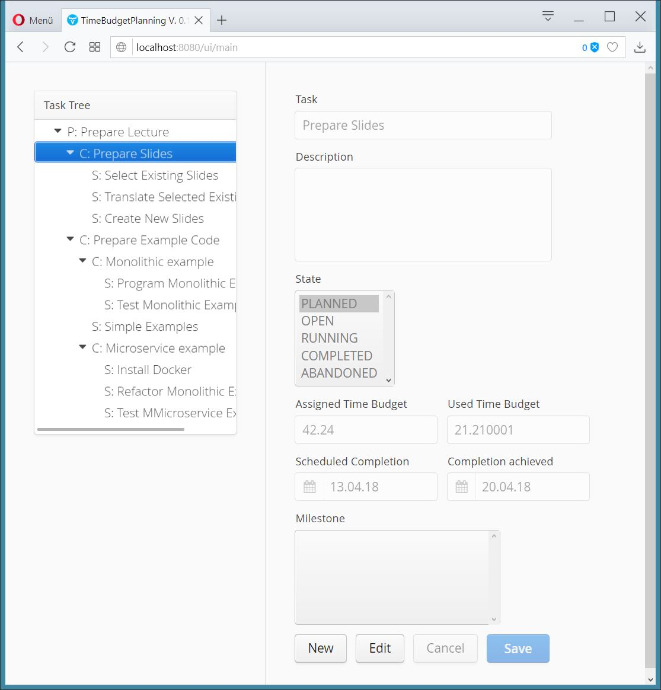

# VaadinBuilder
A groovy builder for easier programmatic construction of Vaadin Web UIs, following Groovy's builder syntax.
A complex Vaadin UI can be created and configured declaratively in an easily understandable form.

## Documentation
* [Builder Keyword Reference](https://github.com/geobe/vaadin-builder/wiki)
* [English Vaadin Builder Tutorial](https://www.georgbeier.de/docs-and-howtos/vaadin_builder_doc/)
* [German Vaadin Builder Tutorial](https://www.georgbeier.de/tutorials-java-und-mehr/java8-spring-groovy-vaadin/vaadin-als-ui-framework/groovy-vaadin-builder/)
* [GroovyDoc](https://geobe.github.io/vaadin-builder-doc/index.html)

## Example
Here is an example for an editing view to be placed inside a split pane:
```groovy
    Component build() {
        topComponent = vaadin."$C.vlayout"('TaskView',
                [spacing: true, margin: true]) {
            "$F.text"('Task', [uikey: NAME,
                               width: '80%'])
            "$F.textarea"('Description', [uikey: DESCRIPTION,
                                          width: '80%'])
            "$F.list"('State', [uikey: STATE,
                                items: STATES,
                                rows : STATES.size()])
            "$C.hlayout"([uikey       : 'timebudgets',
                          spacing     : true,
                          gridPosition: [0, 1, 1, 1]]) {
                "$F.text"('Assigned Time Budget', [uikey: TIME_BUDGET_PLAN])
                "$F.text"('Used Time Budget', [uikey  : TIME_BUDGET_USED,
                                               enabled: false])
            }
            "$C.hlayout"([uikey  : 'schedules',
                          spacing: true]) {
                "$F.date"('Scheduled Completion', [uikey: COMPLETION_DATE_PLAN])
                "$F.date"('Completion achieved', [uikey  : COMPLETION_DATE_DONE,
                                                  enabled: false])
            }
            "$F.list"('Milestone', [uikey: MILESTONE,
                                    rows : 5,
                                    width: '80%'])
            "$C.hlayout"([uikey: 'buttonfield', spacing: true]) {
                "$F.button"('New',
                        [uikey         : 'newbutton',
                         disableOnClick: true,
                         clickListener : { viewBehavior.execute(DVEvent.Create) }])
                "$F.button"('Edit',
                        [uikey         : 'editbutton',
                         disableOnClick: true,
                         clickListener : { viewBehavior.execute(DVEvent.Edit) }])
                "$F.button"('Cancel',
                        [uikey         : 'cancelbutton',
                         disableOnClick: true,
                         enabled       : false,
                         clickListener : { viewBehavior.execute(DVEvent.Cancel) }])
                "$F.button"('Save',
                        [uikey         : 'savebutton',
                         disableOnClick: true, enabled: false,
                         clickShortcut : ShortcutAction.KeyCode.ENTER,
                         styleName     : ValoTheme.BUTTON_PRIMARY,
                         clickListener : { viewBehavior.execute(DVEvent.Save) }])
            }
        }
        topComponent
    }
```

It will expand to the right pane of this window:


